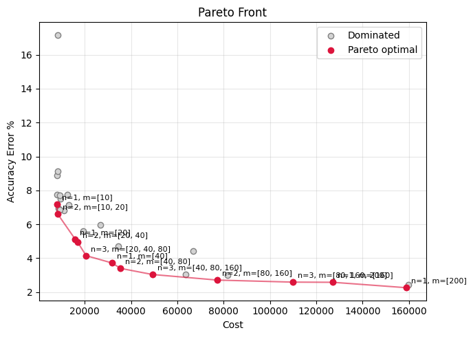
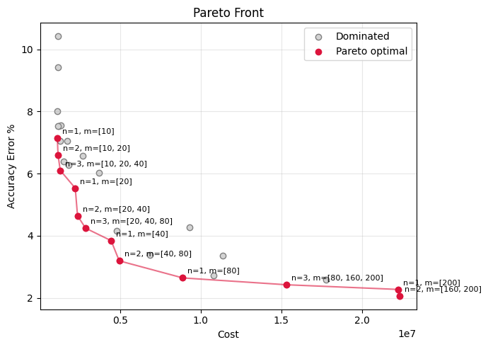

# ELCT918 Lab 1 Assignment  
## Multi-Objective Design Space Exploration of Neural Network Hyperparameters

This project is developed as part of **ELCT918 — Selected Topics in AI Accelerators Hardware Design** at the **German University in Cairo (GUC)**.

The objective of this assignment is to explore the trade-off between neural network implementation cost and classification accuracy by performing a **Multi-Objective Design Space Exploration (DSE)** over different fully connected neural network architectures.

The project uses a parameterizable neural network generator, trains different architectures on the **MNIST handwritten digit dataset**, evaluates their performance, and identifies the **Pareto-optimal configurations**.

---

# Project Overview

The project consists of two main parts:

## Task 1 — Parameterizable Neural Network Generator

A reusable fully connected neural network generator was implemented using **PyTorch**.

Instead of manually creating separate models for different architectures, a single parameterized model is generated dynamically depending on:

- Number of hidden layers (`n`)
- Number of nodes in each hidden layer (`m_array`)

The generated architecture follows:

```

Input Layer (784 neurons)
|
Hidden Layers
|
Output Layer (10 neurons)

```

where:

- 784 represents the flattened 28×28 MNIST image pixels.
- 10 represents the ten MNIST digit classes.

The model supports different depths and widths without modifying the network definition.

---

# Task 1 Training Setup

The neural networks are trained and evaluated using the MNIST dataset.

## Dataset

- Training samples: 60,000 images
- Testing samples: 10,000 images
- Image size: 28×28 grayscale pixels

## Training Configuration

| Parameter | Value |
|---|---|
| Framework | PyTorch |
| Loss Function | Cross-Entropy Loss |
| Optimizer | Adam |
| Learning Rate | 0.001 |
| Batch Size | 64 |
| Epochs | 10 |

---

# Task 1 Results

Several architectures were generated to verify that the network generator can successfully create and train different neural networks.

| Hidden Layers | Nodes per Layer | Parameters | Test Accuracy |
|---|---|---|---|
| 2 | [64,64] | 55,050 | 96.82% |
| 1 | [128] | 101,770 | 97.73% |
| 3 | [64,64,64] | 59,210 | 97.10% |
| 3 | [128,128,128] | 134,794 | 97.55% |

---

# Task 2 — Design Space Exploration

The second part performs a Design Space Exploration over different neural network configurations.

The explored parameters are:

## Number of Hidden Layers

```

n = 1 → 5

```

## Layer Widths

The node widths are selected from:

```

[10, 20, 40, 80, 160, 200]

````

Different architectures are generated, including:

- Uniform-width networks
- Increasing-width (funnel) networks
- Deep and shallow architectures

A total of **30 unique configurations** were trained and evaluated.

---

# Cost Model

The implementation cost of each neural network is evaluated using two different cost metrics.

## 1. Parameter Count Cost (Simple Proxy)

The first cost metric uses the total number of trainable parameters as a simple estimation of the hardware implementation cost:

```python
Total Parameters = sum(p.numel() for p in model.parameters())   
````
This metric represents the network size and the required memory storage for the model weights.

## 2. Hardware-Aware Cost Model

The second cost metric follows the cost model introduced in the reference paper.

The cost is calculated as:
##trying to optimize code length
#the working code
# ============================================================
# neural network — training on handwritten digits (MNIST)
# ============================================================

import torch
import torch.nn as nn
from torch.utils.data import DataLoader
from torchvision import datasets, transforms
import matplotlib.pyplot as plt
import numpy as np

# ------------------------------------------------------------
# Get the training images (MNIST downloads automatically)
# ------------------------------------------------------------
transform = transforms.Compose([
    transforms.ToTensor()  # converts each image into numbers PyTorch can use (Normalize it)
])

train_data = datasets.MNIST(
    root="./data",        # where to save the downloaded images
    train=True,           # use the training set (60,000 images)
    download=True,        # download it if not already saved
    transform=transform
)

test_data = datasets.MNIST(
    root="./data",
    train=False,           # use the test set (10,000 images) to check accuracy
    download=True,
    transform=transform
)

# DataLoader feeds images to the network in small batches (64 at a time)
train_loader = DataLoader(train_data, batch_size=64, shuffle=True)
test_loader = DataLoader(test_data, batch_size=64, shuffle=False)

print(f"Training images: {len(train_data)}")
print(f"Test images: {len(test_data)}")

# ------------------------------------------------------------
# Define the network (parametrized network)
# ------------------------------------------------------------
class parameterized_nn(nn.Module):
    def __init__(self , n , m_array_per_nn , input_size=784 , output_size=10):

      #n is number of hidden layers , m is nodes per hidden layer
        super().__init__()

        m_array_per_nn = np.asarray(m_array_per_nn)

        layers_array = []
        layer_in_size = input_size

        #i wnat a for loop bec n is variable
        for i in range(n):
          layers_array.append(nn.Linear(layer_in_size , m_array_per_nn[i]))
          layer_in_size = m_array_per_nn[i]

        self.hidden_layers = nn.ModuleList(layers_array)
        self.output_layer = nn.Linear(layer_in_size,output_size)

    def forward(self, x):
        x = x.view(x.size(0), -1)        # flatten 28x28 image into 784 numbers
        for layer in self.hidden_layers:
          x = torch.relu(layer(x))      # weighted sum + ReLU activation

        return self.output_layer(x)

def count_parameters(model):
    return sum(p.numel() for p in model.parameters())

# ------------------------------------------------------------
##### Another hardware-aware implementation of the cost  #####
# ------------------------------------------------------------
def hardware_aware_cost(layer_sizes, weight_unit_cost = 139, multiplication_unit_cost = 1):

    total_weights = 0
    total_multiplications = 0

    for i in range(len(layer_sizes) - 1):
        total_weights += layer_sizes[i] * layer_sizes[i + 1]
        total_multiplications += layer_sizes[i] * layer_sizes[i + 1]

    cost = total_weights * weight_unit_cost + total_multiplications * multiplication_unit_cost
    return cost

##the bounded design space
n_array = [1,2,3,4,5]
m_array = [[10],[10,20],[10,20,40],[10,20,40,80],[10,20,40,80,160],[10,20,40,80,160,200]]
#n_array = [1,2,3]
#m_array = [[10],[10,20],[10,20,40]]

accuracy_array = []
accuracy_drop_array = []
#parameter_count_array = []
cost_array = []

points_array = []

seen = set()                                   # sets doesn't allow duplications

for n in n_array:
  for m in m_array:
    if len(m) < n:
      m = list(m) + [m[-1]] * (n - len(m))
      cfg = (n, tuple(m))                        # tuples can go in a set, lists can't
      if cfg in seen:
        continue                                 # already trained this one, skip
      seen.add(cfg)

    elif len(m) > n:
      for b in range(len(m) - n + 1):
        mm = m[b:n+b]

        cfg = (n, tuple(mm))                        # tuples can go in a set, lists can't
        if cfg in seen:
          continue                                 # already trained this one, skip
        seen.add(cfg)

print(seen)
        ####################################################################################
for value in seen:
  (n , mm) = value
  mm = list(mm)
  model = parameterized_nn(n,mm)

  loss_fn = nn.CrossEntropyLoss()
  optimizer = torch.optim.Adam(model.parameters(), lr=1e-3)

# ------------------------------------------------------------
# Train the network
# must be the same across trials
# ------------------------------------------------------------
  epochs = 5  # how many times we loop over the entire dataset 100 as the paper
  print(f"\n\ncurrently exploring model(n= {n},m= {mm})")
  for epoch in range(epochs):
      model.train()
      total_loss = 0

      for images, labels in train_loader:
          optimizer.zero_grad()             # clear old gradients
          outputs = model(images)           # forward pass
          loss = loss_fn(outputs, labels)   # compute how wrong we are
          loss.backward()                   # backpropagation (compute gradients)
          optimizer.step()                  # gradient descent (update weights)

          total_loss += loss.item()

      avg_loss = total_loss / len(train_loader)
      print(f"Epoch {epoch+1}/{epochs} — Loss: {avg_loss:.4f}")

  # ------------------------------------------------------------
  # Test how well it learned
  # ------------------------------------------------------------
  model.eval()
  correct = 0
  total = 0

  with torch.no_grad():  # no need to track gradients when just testing
      for images, labels in test_loader:
          outputs = model(images)
          predictions = torch.argmax(outputs, dim=1)  # pick the highest-scoring digit
          correct += (predictions == labels).sum().item()
          total += labels.size(0)

  accuracy = 100 * correct / total
  accuracy_drop = 100 - accuracy

  accuracy_array.append(accuracy)
  accuracy_drop_array.append(accuracy_drop)

  points_array.append((n,mm))
  architecture = [784] + mm + [10]
  cost = hardware_aware_cost(architecture)
  print(f"\nFinal test accuracy for model(n= {n},m= {mm}) : {accuracy:.2f}%")
  print(f"accuracy drop for model(n= {n},m= {mm}) : {accuracy_drop:.2f}%")
  print(f"cost count for model(n= {n},m= {mm}): {cost}")

  #parameter_count_array.append(count_parameters(model))
  cost_array.append(cost)
        ####################################################################################
pareto_array = np.column_stack((cost_array,accuracy_drop_array))
print(pareto_array)
plt.scatter(cost_array, accuracy_drop_array)
plt.xscale("log") # Make it log scale for viewing the cost in efficient way


for i in range(len(cost_array)):
    u , o = points_array[i]

    plt.annotate(
        f"n={u}, m={o}",
        (cost_array[i], accuracy_drop_array[i]),
        xytext=(5, 5),
        textcoords="offset points"
    )


plt.xlabel("cost(hardware-aware count)")
plt.ylabel("accuracy drop")
plt.title("DSE")
#print(model)
plt.show()
#print(f"\nmaximum accuracy = {max(accuracy_array)}")


######################################
def pareto_front(points, minimize=(True, True)):
    """Return a boolean mask of non-dominated points.

    points   : (N, 2) array of objective values
    minimize : per-objective flag; True = smaller is better, False = larger is better
    """
    pts = np.asarray(points, dtype=float).copy()
    #print(pts)
    # Flip signs so every objective becomes "minimize"
    for i, m in enumerate(minimize):
        if not m:
            pts[:, i] = -pts[:, i]

    n = len(pts)
    is_optimal = np.ones(n, dtype=bool)
    for i in range(n):
        # Point j dominates i if it is <= in all objectives and < in at least one
        dominated = np.all(pts <= pts[i], axis=1) & np.any(pts < pts[i], axis=1)
        if dominated.any():
            is_optimal[i] = False
    return is_optimal


def plot_pareto(points, minimize=(True, True), labels=("Objective 1", "Objective 2")):
    points = np.asarray(points)
    mask = pareto_front(points, minimize)
    front = points[mask]

    # Sort front by first objective so the line connects neatly
    front = front[np.argsort(front[:, 0])]

    fig, ax = plt.subplots(figsize=(7, 5))
    ax.scatter(*points[~mask].T, c="lightgray", edgecolor="gray", label="Dominated") #Dominated
    ax.scatter(*front.T, c="crimson", zorder=3, label="Pareto optimal")  #pareto
    #ax.step(front[:, 0], front[:, 1], where="post", c="crimson", alpha=0.6)
    ax.plot(front[:, 0], front[:, 1], c="crimson", alpha=0.6, marker="o")

    for i in np.where(mask)[0]:
      u, o = points_array[i]
      ax.annotate(f"n={u}, m={o}",
      (points[i, 0], points[i, 1]),
      xytext=(5, 5), textcoords="offset points", fontsize=8)

    ax.set_xlabel(labels[0])
    ax.set_ylabel(labels[1])
    ax.set_title("Pareto Front")
    ax.grid(alpha=0.3)
    ax.legend()
    plt.xscale("log") # Make it log scale for viewing the cost in efficient way
    plt.tight_layout()
    plt.show()

plot_pareto(pareto_array, minimize=(True, True), labels=("Cost", "Accuracy Error %"))

$$
Cost =
(\text{Number of Weights} \times \text{Weight Unit Cost})
+
(\text{Number of Multiplications} \times \text{Multiplication Unit Cost})
$$

where:

- **#Weights** represents the total number of weights in all fully connected layers.
- **#Multiplications** represents the number of multiplication operations required during inference.
- **Weight Unit Cost** represents the normalized cost of accessing weights from memory.
- **Multiplication Unit Cost** represents the normalized computation cost.

The normalized values used are:

- Weight Unit Cost = 139
- Multiplication Unit Cost = 1

The multiplication cost is normalized to 1 based on the energy cost of a multiply-accumulate operation, while the weight access cost is set to 139 because memory access consumes significantly more energy compared to computation.

Therefore, the hardware-aware cost is calculated as:

Hardware Cost = (Number of Weights × 139) + (Number of Multiplications × 1)

Both cost metrics are applied consistently across all explored architectures and are used to analyze the trade-off between implementation cost and classification accuracy.

Each architecture is evaluated based on two objectives:

1. Minimize parameter count (hardware cost)
2. Minimize accuracy drop

where:

```
Accuracy Drop = 100 - Test Accuracy
```

---

# Pareto Front Analysis

A configuration is considered Pareto-optimal if no other configuration provides:

* Lower or equal cost
* Lower or equal accuracy drop

while being strictly better in at least one objective.

The Pareto-front computation is implemented using a dominance check over all explored configurations.

The final exploration produced **13 Pareto-optimal configurations**.

---

# Results Visualization

The project generates a Pareto-front plot showing the relationship between:

* Neural network cost (number of parameters/Hardware-Aware Cost)
* Accuracy drop

The plot can be found here:

```
pareto_front.png
pareto_front_hardwareawarecost.png
```

Example:
### For No. of parameters 

### For Hardware-aware cost model


---

# Technologies Used

* Python 3
* PyTorch
* Torchvision
* NumPy
* Matplotlib
* Jupyter Notebook

---

# Installation

Clone the repository:

```bash
git clone https://github.com/bahaahassan4/ELCT918.git
```

Navigate to the assignment folder:

```bash
cd ELCT918/Lab\ 1\ assignment
```

Install the required dependencies:

```bash
pip install torch torchvision numpy matplotlib jupyter
```

---

# How to Run

1. Start Jupyter Notebook:

```bash
jupyter notebook
```

2. Open the project notebook.

3. Run the cells sequentially.

The notebook will:

* Load the MNIST dataset
* Generate neural network architectures
* Train each configuration
* Evaluate accuracy
* Calculate parameter count
* Compute the Pareto-optimal front
* Generate the Pareto-front visualization

---

# Project Structure

```
Lab 1 assignment/
│
├── README.md
│
├── Lab_1_Final.ipynb
│
└── pareto_front.png
```

---

# Authors

**Shrouq Mohamed**
**BahaaElDin Hassan**

German University in Cairo
Faculty of Information Engineering and Technology

---

# Course Information

**Course:** ELCT918
**Course Title:** Selected Topics in AI Accelerators Hardware Design

**Lab Assignment:** 1
**Topic:** Multi-Objective Design Space Exploration of Neural Network Hyperparameters
